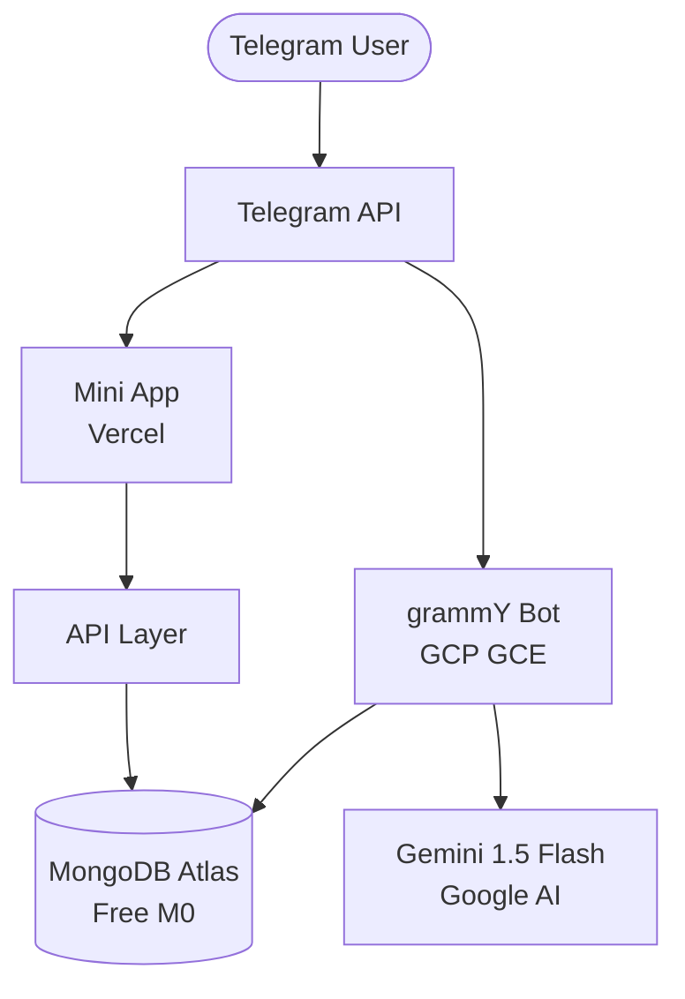

# ScaleWise AI — Phased Implementation & Deployment Plan

## Project Overview

**ScaleWise AI** is a Telegram-based AI-powered diet & fitness assistant that uses Gemini 1.5 to provide personalized nutrition plans, food image analysis, activity tracking, and behavioral coaching. It's delivered through a **Telegram Bot** (for interactions) and a **Telegram Mini App** (for dashboards).

### Tech Stack
| Layer | Technology |
|---|---|
| Runtime | Node.js (grammY framework) |
| AI Engine | Google Generative AI (Gemini 1.5 Flash) |
| Database | MongoDB Atlas (free M0 tier) + Mongoose ODM |
| Bot Hosting | GCP (Compute Engine + Artifact Registry) |
| **CI/CD** | **GitHub Actions** |
| Mini App Hosting | Vercel |
| Mini App Frontend | React + Vite (recommended) |

---

## Phase 1 — Foundation & Onboarding *(Weeks 1–3)*

> **Goal**: Get a working bot deployed that can onboard users and store their profiles.

### Deliverables
1. **Project scaffolding** — monorepo with `bot/` and `webapp/` directories
2. **Database models** — `User`, `Profile`, `DailyLog` collections via Mongoose
3. **Telegram Bot skeleton** — grammY setup, command routing, conversation middleware
4. **Onboarding Wizard** — conversational flow collecting:
   - Goal (deficit / surplus)
   - Age, Height, Weight, Gender
   - Activity level → TDEE estimation
   - Dietary archetype (Veg / Vegan / Jain / Non-Veg) + regional tag
5. **BMR/TDEE calculator** — Mifflin–St Jeor formula implementation
6. **CI/CD Pipeline** — Automated deployment via GitHub Actions

### Technical Details

```
scalewise/
├── .github/workflows/    # CI/CD pipelines
│   └── deploy.yml        # Bot deployment to GCP
├── bot/                  # grammY Telegram bot
│   ├── src/
│   │   ├── index.ts
│   │   ├── conversations/   # grammY conversations plugin
│   │   ├── commands/
│   │   ├── models/          # Mongoose schemas & models
│   │   ├── services/        # business logic
│   │   └── utils/
│   ├── Dockerfile           # Production container definition
│   ├── startup.sh           # GCP VM startup script
│   ├── setup-docker.sh      # Instance provisioning script
│   ├── package.json
│   └── tsconfig.json
├── webapp/               # Telegram Mini App (Phase 4)
├── shared/               # shared types & constants
└── package.json          # root workspace
```

### Phase 1 Deployment
| Component | Target | Strategy |
|---|---|---|
| Bot | GCP Compute Engine | **Automated via GitHub Actions** (Build -> Push to GAR -> SSH Deploy) |
| Database | MongoDB Atlas | Free M0 cluster (512 MB), connect via `MONGODB_URI` env var |

> [!IMPORTANT]  
> Phase 1 ships a **live, usable bot** on Telegram. Users can onboard and a profile is persisted. This is the MVP entry point.

---

## Phase 2 — Core Diet Engine + Gemini Vision *(Weeks 4–6)*

> **Goal**: Deliver the daily diet planner and food image analysis — the two highest-value features.

### Deliverables
1. **Daily Diet Architect**
   - Morning Blueprint: scheduled 7 AM message with day plan (based on weight velocity)
   - Meal logging commands (`/log breakfast ...`, photo upload)
   - Reactive Menu Adjustment: recalculates remaining meals after each log
   - Protein-First Nudges: hourly protein tracking & "Protein Rescue" suggestions
2. **Gemini Vision Auditor**
   - Image-to-Macro: user sends food photo → Gemini identifies dish, estimates macros
   - Restaurant Rescue: menu photo → goal-aligned dish recommendations
   - Kitchen Assistant: `/pantry` command → macro-compliant recipe generation
3. **Weight logging** — `/weight 72.5` to track daily weigh-ins, weight velocity calculation

### Technical Details
- Gemini 1.5 Flash API integration via `@google/generative-ai` SDK
- Prompt engineering for Indian regional food recognition
- Cron jobs via `node-cron` (runs in-process) for morning blueprints & protein nudges
- `DailyPlan`, `MealLog`, `WeightLog` Mongoose models

### Phase 2 Deployment
- Same GCP bot deployment; new Mongoose models auto-sync (no migrations needed)
- No new infrastructure needed — incremental feature deployment

> [!TIP]
> After Phase 2, the bot becomes **genuinely useful** for daily diet tracking. This is the point to start early user testing / beta invites.

---

## Phase 3 — Activity Tracking & Behavioral Tools *(Weeks 7–9)*

> **Goal**: Complete the calorie-out side and add the psychological / behavioral layer.

### Deliverables
1. **MET Activity Parser**
   - `/activity walk 30min`, `/gym bench_press 4x12 60kg`
   - MET formula: `(MET × Weight_kg × Duration_hr)`
   - Energy-Out Balancing: auto-adjust daily calorie budget after activity
   - Built-in MET database for common activities & gym movements
2. **Tax Negotiator**
   - Step Tax: `/tax samosa` → "That's 250 kcal = 4,200 steps. Walk it off?"
   - Gains Tax: missed protein target → increased density requirement for next meal
   - Urge Surfing: `/crave` → guided 5-minute mindfulness intervention
3. **Cheat Day Manager**
   - `/cheat set saturday` → schedule cheat day
   - Calorie Banking: auto-reduce 100–200 kcal/day leading up to cheat day
   - Post-cheat Recovery Pivot: next-morning menu (hydration + high-protein + low-sodium)
   - Sodium Correlation: flag post-cheat weight spikes as water retention

### Technical Details
- `ActivityLog` Mongoose model with MET values
- Pre-seeded MET lookup table (JSON or DB seed)
- Stateful cheat-day scheduler with banking logic
- `CheatDay`, `CravingLog` Mongoose models

### Phase 3 Deployment
- Same GCP deployment, no migrations needed
- No additional infra

---

## Phase 4 — Mini App Dashboard + Safety Features *(Weeks 10–13)*

> **Goal**: Launch the Telegram Mini App for visual analytics and add safety monitoring.

### Deliverables
1. **Telegram Mini App (TMA)**
   - React + Vite SPA launched via Telegram's Mini App SDK
   - **Weight Velocity Chart**: trend line with 7-day moving average
   - **Nutritional Trends**: macro breakdown over time (bar/line charts)
   - **Activity Heatmap**: calendar heatmap of activity intensity
   - **Streak Dashboard**: visual badges & consistency streaks
   - Auth via Telegram `initData` validation
2. **Safety & Recovery**
   - Active Recovery Triggers: force rest day alerts after high-impact streaks
   - Hydration Guard: sodium-driven weight spike warnings
   - Periodic Metric Comparison: body metrics vs. progress trends validation

### Technical Details
- `webapp/` directory: React + Vite + `@twa-dev/sdk`
- Charts: Recharts or Chart.js
- API layer: lightweight Express API in the bot (on GCP) or separate Vercel serverless functions
- Telegram Mini App launch via `web_app` button in bot

### Phase 4 Deployment
| Component | Target | Strategy |
|---|---|---|
| Mini App | Vercel | Deploy `webapp/` via Vercel CLI or GitHub integration |
| API | GCP (same bot) or Vercel Functions | Depends on complexity |

> [!IMPORTANT]
> This is the first phase requiring **two deployment targets** (GCP + Vercel). Set up CI/CD for both.

---

## Phase 5 — Automation, Social & Polish *(Weeks 14–16)*

> **Goal**: Add proactive nudges, the buddy system, and production hardening.

### Deliverables
1. **Proactive Automation**
   - Time-Buffered Nudges: "You haven't logged lunch yet" after configurable delays
   - Smart notification timing based on user's historical logging patterns
2. **Buddy System**
   - Pair two users as accountability partners
   - 48-hour inactivity alert sent to buddy
   - Optional shared progress view
3. **Streak Engine**
   - Visual badge system (🔥 7-day, ⭐ 30-day, 💎 90-day)
   - Streak recovery grace period
4. **Production Hardening**
   - Rate limiting & error boundaries
   - Gemini API fallback handling
   - Logging & monitoring (GCP logs + Sentry or similar)
   - User data privacy controls (`/deletedata`)

### Phase 5 Deployment
- Final production deployment with monitoring
- Both GCP (bot) and Vercel (webapp) in production tiers

---

## Deployment Architecture Summary



## Phase-wise Deployment Checklist

| Phase | What's Live | Infra Needed |
|---|---|---|
| **Phase 1** | Bot + Onboarding | GCP (GCE + Artifact Registry) + MongoDB Atlas (free) |
| **Phase 2** | + Diet Engine + Vision | + Google AI API key |
| **Phase 3** | + Activity + Behavioral | No new infra |
| **Phase 4** | + Mini App + Safety | + Vercel (webapp) |
| **Phase 5** | + Automation + Social | + Monitoring (optional Sentry) |
3** | + Activity + Behavioral | No new infra |
| **Phase 4** | + Mini App + Safety | + Vercel (webapp) |
| **Phase 5** | + Automation + Social | + Monitoring (optional Sentry) |

---

## Prerequisites Before Starting

1. **Telegram Bot Token** — create via [@BotFather](https://t.me/BotFather)
2. **Google AI API Key** — from [Google AI Studio](https://aistudio.google.com/apikey)
3. **MongoDB Atlas Account** — free M0 cluster at [mongodb.com/atlas](https://www.mongodb.com/atlas)
4. **Koyeb Account** — free tier at [koyeb.com](https://www.koyeb.com)
5. **Vercel Account** — for Mini App hosting (needed from Phase 4)
6. **Node.js 20+** installed locally

---

## Verification Plan

### Per-Phase Smoke Tests
- **Phase 1**: Send `/start` → complete onboarding → verify profile stored in DB
- **Phase 2**: Send food photo → verify macro response; check 7 AM cron fires
- **Phase 3**: `/activity walk 30min` → verify calorie adjust; `/crave` → verify flow
- **Phase 4**: Open Mini App → verify charts render with real user data
- **Phase 5**: Stop logging for 48h → verify buddy notification fires

### Manual Verification
- After each phase, test the bot manually on Telegram
- Verify database state via MongoDB Atlas web UI or MongoDB Compass
- Check Koyeb deployment logs for errors

> [!NOTE]
> Each phase ships a **deployable increment**. You don't need to wait until Phase 5 to have a working product — Phase 1 itself is a live bot, and Phase 2 makes it genuinely useful.
